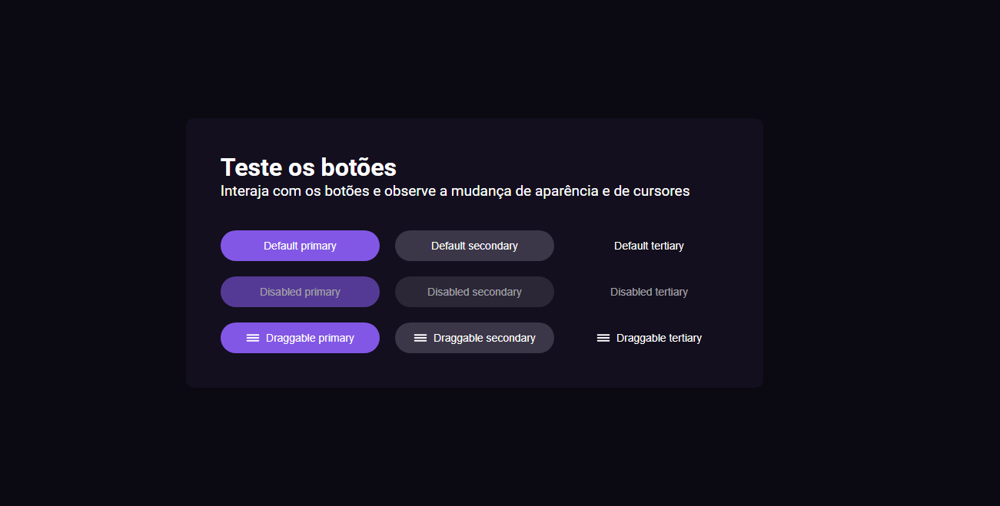

<h3 align="center">#boraCodar #03 💻</h3>
<h1 align="center">Botões e cursores 🛒</h1>

#boraCodar são desafios semanais, promovido pela Rocketseat para ensino de tecnologias WEB.  

  <a href="#-tecnologias">Tecnologias</a>&nbsp;&nbsp;&nbsp;|&nbsp;&nbsp;&nbsp;
  <a href="#-Aprendizado">Aprendizado</a>&nbsp;&nbsp;&nbsp;|&nbsp;&nbsp;&nbsp;
  <a href="#-layout">Layout</a>&nbsp;&nbsp;&nbsp;|&nbsp;&nbsp;&nbsp;
  <a href="#-Preview">Preview</a>&nbsp;&nbsp;&nbsp;|&nbsp;&nbsp;&nbsp;
  <a href="#memo-licença">Licença</a>

  

 

  

## 🚀 Tecnologias

Esse projeto foi desenvolvido com as seguintes tecnologias:

- HTML e CSS
- Vite
- ReactJS
- TypeScript
- Git e Github
- Figma

## 📚 Aprendizado

Com esse desafio aprendi a lidar com comportamentos que melhoram a acessibilidade do usuário e também como lidar com darg & drop.

## 🔖 Layout

Você pode ter acesso ao layout desse projeto por meio [desse link](https://www.figma.com/community/file/1197534710257750520).

## 👨‍💻 Preview

Você pode acessar o projeto online pelo link abaixo:  

<a href="https://bora-codar-button-cursors-82md.vercel.app" _blank>Button&Cursors</a>

O site está hosepdado na vercel.

## :memo: Licença

Esse projeto está sob a licença MIT.

---

Feito com ♥ by Vinicius Santos 👨‍💻 [Entre em contato!](https://www.linkedin.com/in/viniciussantos31/)
